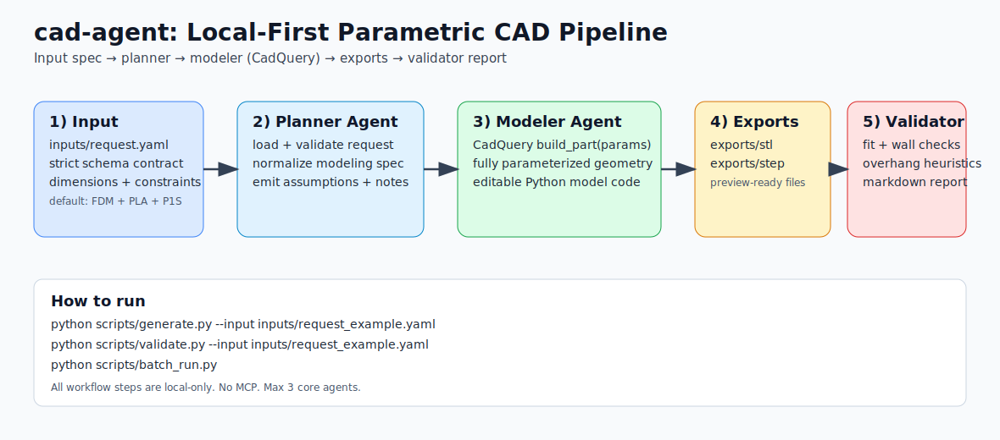

# cad-agent

A local-first MVP scaffold for **agent-assisted parametric 3D-printable design** using Python and CadQuery.

This repository helps you go from:

1. rough dimensional request (YAML + sketch notes)
2. to a normalized structured spec
3. to a generated parametric CAD model
4. to STL/STEP export
5. to printability validation report

## Why CadQuery as the core

CadQuery keeps the source of truth in code:

- fully parameterized models
- scriptable and version-controllable geometry
- deterministic exports (STL/STEP)
- easy transition from MVP scripts to reusable part libraries

CQ-Editor is optional for visual debugging. FreeCAD is optional for fallback inspection only.

## MVP scope

Optimized for dimension-based FDM parts:

- brackets
- clips
- holders
- mounts
- spacers
- simple enclosures
- adapter blocks
- cable guides

Intentionally out of scope:

- artistic meshes / sculpting
- Blender-centric workflows
- GUI-only modeling pipelines
- cloud execution
- large multi-part assemblies


## Pipeline graphic



## Requirements

- Python 3.11+
- Manual dependency install from `requirements.txt`
- Local filesystem workflow (no MCP, no cloud dependency)

## Setup

```bash
cd cad-agent
python -m venv .venv
source .venv/bin/activate
pip install -r requirements.txt
```

## First run

Run the full pipeline on sample input:

```bash
python scripts/generate.py --input inputs/request_example.yaml
```

Expected outputs:

- `exports/stl/*.stl`
- `exports/step/*.step`
- `reports/validation/*.md`

Validate an existing normalized spec:

```bash
python scripts/validate.py --input inputs/request_example.yaml
```

Batch-process all request YAML files in `inputs/`:

```bash
python scripts/batch_run.py
```

## Input contract

The strict YAML contract is defined by:

- `specs/part_request.schema.json` (JSON schema)
- `agents/planner.py` + pydantic request models

All dimensions are in **mm** unless explicitly overridden.

## Printer presets

`specs/printers.yaml` contains printer profiles (starting with `bambulab_p1s`).

To add a printer:

1. add a new top-level printer key to `specs/printers.yaml`
2. copy the same field structure used by `bambulab_p1s`
3. set build volume, nozzle, process limits, and printability defaults

## Extending part types

- Add reusable geometry primitives in `models/library/`
- Add additional `build_part(params)` implementations under `models/`
- Route part selection in `agents/modeler.py`
- Keep dimensions explicit; avoid hidden defaults and magic numbers

## Design principles

- Local-first, file-based orchestration
- Max 3 agents (planner/modeler/validator)
- Printability-first decisions
- No silent dimension invention
- Boring, stable Python over overengineering

## Agent operating instructions

Detailed instructions for how each agent works and how to operate the tool are in:

- `docs/agent_instructions.md`

